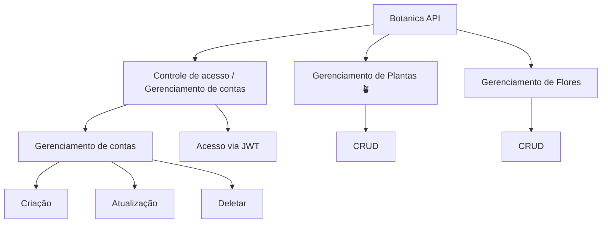
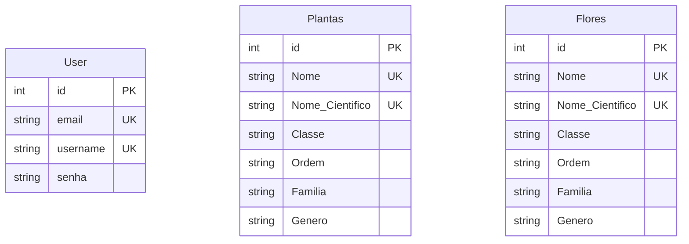

# Botanica API 🪴


<div align="center">
    
    
    
    
</div>

<br>
Welcome to the Botanical API project! This API was created to provide information about a few plants and a variety of flowers. It is a relatively simple model, with terms more focused on the scientific field.


<br><br>

- [O projeto.](#o-projeto-)
- [A API.](#a-api-)
    - [Contas](#contas)
    - [Plantas e Flores](#plantas-e-flores-)
- [O banco de dados.](#o-banco-de-dados--orm)
- [Tecnologias & Ferramentas](#tecnologias--ferramentas-)

<br>

# O PROJETO. 🌿

The goal of the API is to create and manage some plants. All this in a very simplified context. Using only the basic functionalities for demonstration.

> Why are flowers separated from plants? Because every flower is a plant, but not every plant is a flower! And I hope to divide it into more categories later.

The implementation is based on 3 pillars:



# A API. 🍃

The API is divided into three routers 🪢:

- `Accounts`: Account and API access management.

- `Plants`: Plant management.

- `Flowers`: Plant management.

## Accounts.

This module provides endpoints for managing users in the system, including creating, reading, updating, and deleting users. Below are the details of each available endpoint.

### Endpoints

### 1. List Users

**GET** `/users/`

Returns a list of users with pagination support.

- **Query Parameters**:
- `limit` (int, optional): The maximum number of users to return. Default value: `10`.
- `offset` (int, optional): The number of users to ignore before returning results. Default value: `0`.

- **Response**:
- `200 OK`: A list of users in the format `{ "users": [...] }`.


### 2. Create User

**POST** `/users/`

Creates a new user in the system.

- **Request Body**:
- `UserSchema`: Schema containing `email`, `username` and `password` of the new user.

- **Response**:
- `201 Created`: The newly created user in `UserPublic` format.

- **Errors**:
- `400 Bad Request`: If the `username` or `email` already exists.

### 3. Get User by ID

**GET** `/users/{user_id}`

Returns information for a specific user based on their ID.

- **Path Parameters**:
- `user_id` (int): The user ID to retrieve.

- **Response**:
- `200 OK`: The user details in `UserPublic` format.

- **Errors**:
- `404 Not Found`: If the user with the given `user_id` is not found.

### 4. Update User

**PUT** `/users/{user_id}`

Updates the information of an existing user.

- **Path Parameters**:
- `user_id` (int): The ID of the user to be updated.

- **Request Body**:
- `UserSchema`: Schema containing the new values ​​for `email`, `username`, and `password`.

- **Response**:
- `200 OK`: The updated user details in `UserPublic` format.

- **Errors**:
- `404 Not Found`: If the user with the given `user_id` is not found.
- `401 Unauthorized`: If the authenticated user does not have permission to update the user.

### 5. Delete User

**DELETE** `/users/{user_id}`

Deletes a specific user from the system.

- **Path Parameters**:
- `user_id` (int): The ID of the user to be deleted.

- **Response**:
- `200 OK`: Confirmation message of the deletion in the format `{ "message": "User deleted" }`.

- **Errors**:
- `404 Not Found`: If the user with the given `user_id` is not found.
- `401 Unauthorized`: If the authenticated user does not have permission to delete the user.

**WARNING ⚠️**

> The token expiration time must be 30 minutes, the algorithm used |must be HS256 and the subject must be the email

<br><br>

## Plantas e Flores. 💐

### **1. Create a Plant**

**POST** `/plants/`

**Description**: Creates a new plant in the system.

**Request Body**:
- `plantSchema`: An object containing the plant information (`name`, `scientific_name`, `class`, `order`, `family`, `genus`).

**Success Response**:
```json
{
"id": 1,
"name": "Rosa",
"scientific_name": "Rosa spp.",
"class": "Magnoliopsida",
"order": "Rosales",
"family": "Rosaceae",
"genus": "Rosa"
}
```

**Error Response**:
- **400 Bad Request**: If a plant with the same name already exists. ```json
{
"detail": "This plant already exists. 🍂"
} ```

---

### **2. List Plants**

**GET** `/plants/`

**Description**: Returns a list of plants, with pagination support.

**Query Parameters**:
- `limit` (int, optional): Maximum number of plants to return. Default value: `10`.
- `offset` (int, optional): Number of plants to ignore before starting to return results. Default value: `0`.

**Successful Response**:
```json
{
"Plants": [
{
"id": 1,
"name": "Rosa",
"scientific_name": "Rosa spp.",
"class": "Magnoliopsida",
"order": "Rosales",
"family": "Rosaceae",
"genus": "Rosa"
},
{
"id": 2,
"name": "Sunflower",
"scientific_name": "Helianthus annuus",
"class": "Magnoliopsida",
"order": "Asterales",
"family": "Asteraceae",
"genus": "Helianthus"
}
]
}
```

---

### **3. Filter Plants by Attributes**

**GET** `/plants/?class={class}&order={order}&family={family}&genre={genre}`

**Description**: Filters plants based on attributes such as class, order, family, and genus.

**Query Parameters**:
- `class` (str, optional): Filter by class.
- `order` (str, optional): Filter by order.
- `family` (str, optional): Filter by family.
- `genre` (str, optional): Filter by genus.
- `limit` (int, optional): Limit of results.
- `offset` (int, optional): Offset of results.

**Successful Response**:
```json
{
"Plants": [
{
"id": 3,
"name": "Daisy",
"scientific_name": "Bellis perennis",
"class": "Magnoliopsida",
"order": "Asterales",
"family": "Asteraceae",
"genus": "Bellis"
}
]
}
```

---

### **4. Get a Specific Plant**

**GET** `/plants/{plant_id}`

**Description**: Returns the details of a specific plant based on its ID.

**Path Parameters**:
- `plant_id` (int): ID of the plant to be retrieved.

**Success Response**:
```json
{
"id": 1,
"name": "Rosa",
"scientific_name": "Rosa spp.",
"class": "Magnoliopsida",
"order": "Rosales",
"family": "Rosaceae",
"genus": "Rosa"
}
```

**Error Response**:
- **404 Not Found**: If the plant with the given `plant_id` is not found. ```json
{
"detail": "Plant not found. 🍂"
} ```

---

### **5. Update a Plant**

**PUT** `/plants/{plant_id}`

**Description**: Updates the information of an existing plant.

**Path Parameters**:
- `plant_id` (int): ID of the plant to be updated.

**Request Body**:
- `plantSchema`: Object containing the new values ​​for the plant (`name`, `scientific_name`, `class`, `order`, `family`, `genre`).

**Success Response**:
```json
{
"id": 1,
"name": "Rosa Atualizada",
"nome_scientifico": "Rosa spp.",
"classe": "Magnoliopsida",
"orden": "Rosales",
"familia": "Rosaceae",
"genre": "Rosa"
}
```

**Error Response**:
- **404 Not Found**: If the plant with the given `plant_id` is not found.
```json
{
"detail": "The plant does not exist, it was not found. 🍂"
}
```

---

### **6. Delete a Plant**


**DELETE** `/plants/{plant_id}`

**Description**: Deletes a specific plant from the system.

**Path Parameters**:
- `plant_id` (int): ID of the plant to be deleted.

**Success Response**:
```json
{
"message": "The plant has been deleted 🪓🪚"
}
```

**Error Response**:
- **404 Not Found**: If the plant with the given `plant_id` is not found.
```json
{
"detail": "Plant not found. 🍂"
}
```

---
# O BANCO DE DADOS | ORM. 🌵

The database modeling must have three tables: User, Plants and Flowers.



## Extração dos dados. 🌱

Este projeto utilizou web scraping para extrair informações taxonômicas sobre plantas a partir da [Wikipédia](https://pt.wikipedia.org/wiki/Lista_de_plantas_do_Brasil). Utilizando a biblioteca `BeautifulSoup` para fazer o parsing do HTML, foram coletados dados como nome científico, classe, ordem, família e gênero de diversas plantas. Esses dados foram então armazenados em um banco de dados usando SQLAlchemy, facilitando consultas futuras e garantindo a persistência das informações extraídas.

<p align='center'>

</p>


**AVISO ⚠️**
> Muito dos dados foram retirados de forma bruta. Sem uma limpeza adequada ou verificação de fonte. Para caso exista valores quebrados ou valores irreais.  


# TECNOLOGIAS & FERRAMENTAS. 🌲


1. FastAPI

2. Pydantic

3. SQLAlchemy 

4. Coverage

5. Pytest 

<br>

5. `Hospedagem:` [Fly.io](http://Fly.io)

**AVISO ⚠️**
> This API has not yet gone through the Docker and hosting process.
# Licença

This repository is licensed under the [MIT License](./LICENSE).


---

<br>

<div style="width: 50%; height: 2px; display: flex; justify-content: center; align-items: center; margin: 0 auto;">
    <a href="https://github.com/ViniciusSilveiraCampos" target="_blank"></a>
    <a href="https://www.linkedin.com/in/vinicius-silveira-campos/" target="_blank"></a> 
    <a href="mailto:vinicius.silveira.campos@gmail.com" target="_blank"></a>
</div>

