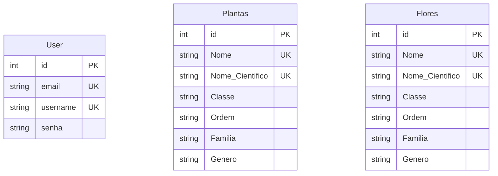

# O BANCO DE DADOS | ORM. 🌵

The database modeling must have three tables: User, Plants and Flowers.

## Extração dos dados. 🌱

This project used web scraping to extract taxonomic information about plants from [Wikipedia](https://pt.wikipedia.org/wiki/Lista_de_plantas_do_Brasil). Using the `BeautifulSoup` library to parse the HTML, data such as scientific name, class, order, family and genus of several plants were collected. This data was then stored in a database using SQLAlchemy, facilitating future queries and ensuring the persistence of the extracted information.

**AVISO ⚠️**
> Much of the data was taken raw. Without proper cleaning or source verification. In case there are broken values ​​or unrealistic values.
