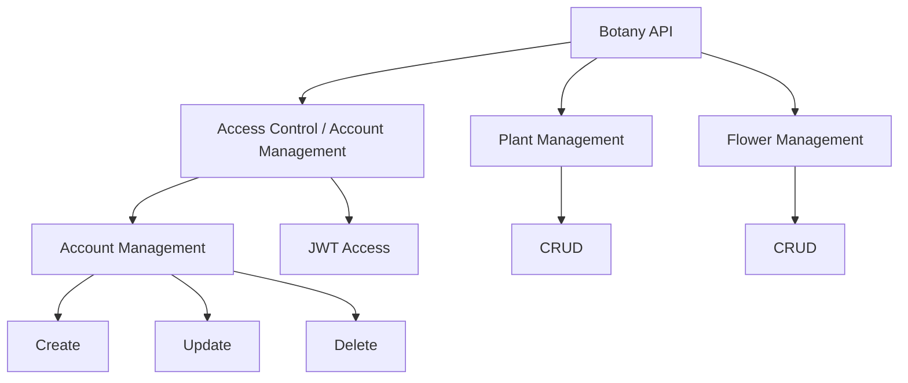

<h1> BOTANICA API. 🌸 </h1>

 <small> 𝓐𝓻𝓽 𝓫𝔂: <a href="https://www.instagram.com/lotusteapot?utm_source=ig_web_button_share_sheet&igsh=ZDNlZDc0MzIxNw=="> @lotusteapot </a> </small> 

The goal of the API is to create and manage some plants. All this in a very simplified context. Using only the basic functionalities for demonstration.

> Why are flowers separated from plants? Because every flower is a plant, but not every plant is a flower! And I hope to divide it into more categories later.

The implementation is based on 3 pillars:

# A API. 🍃

The API is divided into three routers 🪢:

- `Accounts`: Account and API access management.

- `Plants`: Plant management.

- `Flowers`: Plant management.

WARNING ⚠️
> Please note: This project is a demonstration only and is not a hosted API.